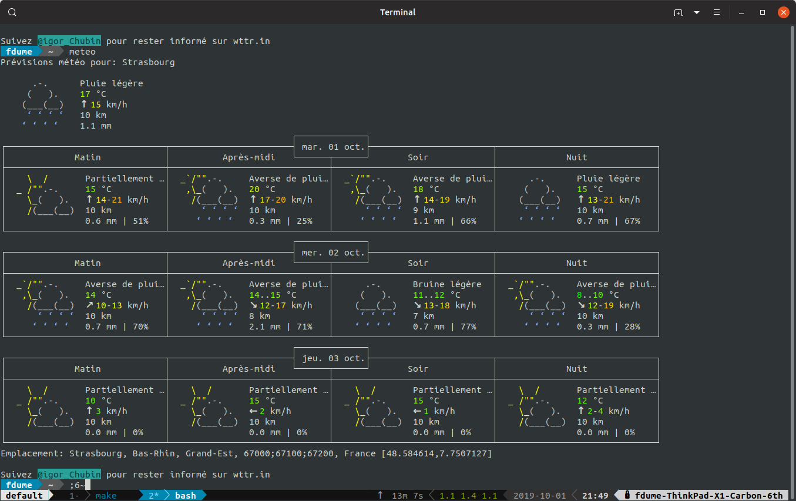
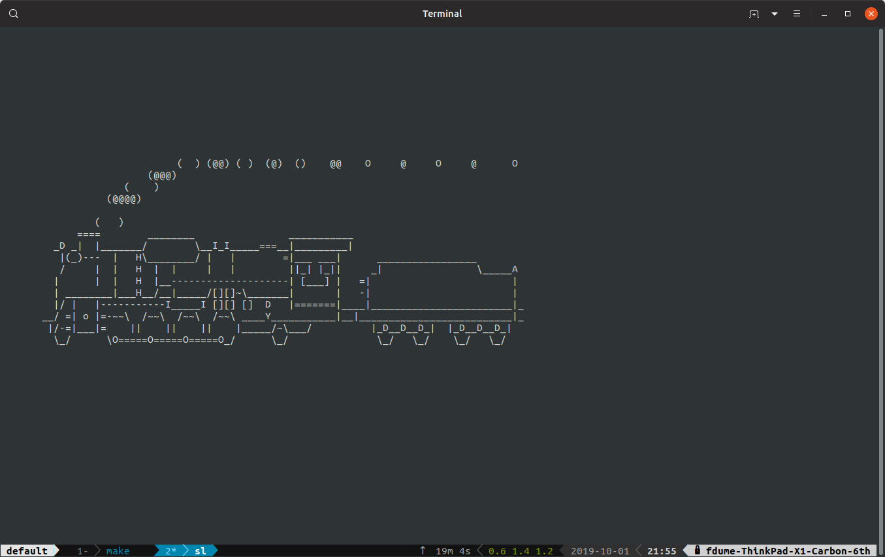
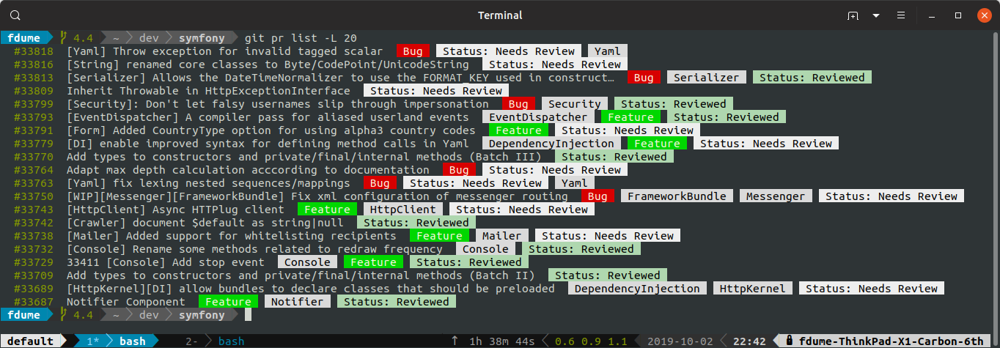

## N'ayez plus peur de votre terminal ! 💻
#### par François Dume

note: 
Bonjour, je m'appelle François Dume. Je vais animer aujourd'hui cet atelier dédié à l'utilisation du terminal.
Mon objectif est de vous donner envie d'utiliser votre terminal et démystifier certains outils.
Cet atelier est accessible à des débutants. Je pensais au départ présenter des outils pour un public intermédiaire mais en discutant avec certain d'entre vous. On m'a conseillé de faire un truc accessible. 
Nous commencerons par des choses simples. Nous verrons sur la fin des choses un peu plus complexes.
Je voulais au départ faire mes slides dans le terminal ([mdp](https://github.com/visit1985/mdp) est chouette) mais je me suis rabattu sur reveal.js.

---

<!-- .slide: data-background-image="data/dan-gold-8PBVWiZR2NM-unsplash.jpg" style="background-color: #333;" -->

 * Présentation axée autour de BASH pour Linux (ça fonctionnera peut-être sur d'autres OS/interpréteurs)
```shell script
# Pour savoir si vous utilisez bash
$ echo $BASH
/bin/bash
# Pour démarrer bash dans un container docker
$ docker run -it bash
```
 * On ne parlera pas de Windows -- .bat -- (même si le terminal s'améliore)
 
note: 
 * c'est le terminal que j'utilise au quotidien
 * ça fonctionnera sûrement sur Mac moins bien sur les vieux Windows
 * au début on verra des choses assez simples mais ça va se complexifier sur la fin
---

### Sujets abordés 📖

 * Trouver de l'aide dans votre terminal
 * Configurer votre terminal (coloration syntaxique, fichiers de configuration, prompt)
 * Présentation de quelques commandes de base
 * Créer des alias, rechercher dans l'historique, dans l'arborescence
 * Raccourcis clavier
 * Gestion des processus
 * Présentation `tmux`
 * Configuration de `git`, utilisation de `hub`
 * Configuration `SSH`, ... 

---

### Command line is fun!🎈

note: 
  J'aime beaucoup mon terminal et j'aimerais vous montrer des choses marrantes à faire. Mais avant de commencer, ... 

---

## Quel temps fait-il aujourd'hui ☀️ ? 

---



---

```
$ curl "wttr.in/Strasbourg?lang=fr"
$ curl "wttr.in/Paris?lang=fr&format=v2"
$ curl "wttr.in/Wasquehal?lang=fr&format=%l:+%c+%t
```

Plein d'autres options :
 
https://github.com/chubin/wttr.in

---
## Quelle est votre IP ?

`$ curl ifconfig.co`

---
## Copie locale d'une vidéo Youtube

`$ youtube-dl url`

https://github.com/ytdl-org/youtube-dl/

---

## Monitoring


https://github.com/sqshq/sampler

---

## Animation : fautes de frappe
 
* `gti` au lieu de `git` : https://github.com/rwos/gti
* `sl` au lieu de `ls`

---



---

#### Les interpréteurs de commandes 

  * [sh](https://fr.wikipedia.org/wiki/Bourne_shell), [csh](https://fr.wikipedia.org/wiki/C_shell), [ksh](https://fr.wikipedia.org/wiki/Korn_shell) : plus anciens
  * [dash ou ash](https://en.wikipedia.org/wiki/Almquist_shell#dash) : Debian Almquist shell, utilisé à la place de sh sous Debian
  * [bash](https://fr.wikipedia.org/wiki/Bourne-Again_shell#Usage) :
    - fusion de l'ensemble des fonctionnalités présentes dans sh, csh, ksh, 
    - présent sur la majorité des systèmes, 
    - ajout de l'autocomplétion (touche `<TAB>`)
  * [zsh](https://en.wikipedia.org/wiki/Z_shell) : par défaut sous MacOS à partir de la version 10.15 (Catalina), étend les fonctionnalités de bash
  * 🐠 [fish](https://en.wikipedia.org/wiki/Friendly_interactive_shell)
  
note: 
  On parlera principalement bash qui est présent par défaut sur la majorité des OS. 
  zsh propose des mécanisme de gestion de l'historique améliorée, recherche intégrée, possibilité de customiser le prompt à droite, ...

---

## A l'aide 🚒

  - `command --help`
  - `man command` (`man man` pour apprendre à utiliser man)
  - `man file.5` : Description du format des fichiers de configuration (exemple : `man passwd.5`)
  - `help command` : De l'aide sur des commandes bash
  - [tldr.sh](https://tldr.sh/) : outil écrit en Node.js permettant de simplifier l'utilisation de man
  - [explainshell](https://explainshell.com/) : outil en ligne permettant d'expliquer une commande shell
  
note: 
 Avant de commencer, j'aimerais vous rendre autonome sur la recherche d'informations. Généralement, votre système disposera de tous les outils vous permettant de comprendre une commande.

---

## Configuration

note:
 Avant de commencer à utiliser votre terminal, il faut que vous soyez à l'aise avec celui-ci. Il y a différentes choses à configurer qui vous rendront la vie un peu plus agréable (couleurs, autocomplétion, prompt, ...).

---

#### Les fichiers de configuration

note:
 Avant de commencer à rentrer dans le vif sujet, il y a quelques fichiers de configuration à connaître. Ils varieront selon votre distribution.

---

`man bash`

 

---


(sources : http://www.solipsys.co.uk/new/BashInitialisationFiles.html)

note:
  Pas totalement vrai mais c'est pour montrer la complexité du truc.

---

| |  Configuration globale | Configuration utilisateur  |
|---|---|---|
| Si auth. (login)| /etc/profile  |   ~/.profile |
| Dans la plupart des cas | /etc/bashrc.bashrc  |   ~/.bashrc |

---
### Les fichiers de configuration : `~/.profile`

Recommendation:  `~/.profile` doit charger le `~/.bashrc` (permet de charger le `~/.bashrc` lorsque bash est démarré en mode "login").

```
# ~/.bashrc
if [ -n "$BASH_VERSION" ]; then
    # include .bashrc if it exists
    if [ -f "$HOME/.bashrc" ]; then
        . "$HOME/.bashrc"
    fi
fi
```

---
### Recharger votre configuration

```
# Plusieurs options
# 1- Fermer et relancer votre terminal
# 2- Utiliser le point
. ~/.bashrc
# 3- Utiliser la commande source
source ~/.bashrc
```

---
## Un peu de couleurs 🌈
---

Coloration syntaxique activée par défaut sur la plupart des systèmes

```
# vérifier que la couleur est bien activée
$ echo "$TERM"
xterm-256color
screen-256color # si vous utilisez tmux
```
 
```
# pour activer la couleur
~/.bashrc
export TERM="xterm-256color" 
```
note:
 * Pour savoir si la coloration syntaxique est activable dans votre environnement, vérifier la variable d'environnement $TERM

---

Définissez des alias pour activer la couleur sur certaines commandes 

```
~/.bash_aliases
alias ls='ls --color=auto'
alias dir='dir --color=auto'
alias grep='grep --color=auto'
alias fgrep='fgrep --color=auto'
alias egrep='egrep --color=auto'
```

Les alias sont activés par défaut sur certains environnements, pour le vérifier : 

```shell script
$ type -a ls
ls est un alias vers « ls --color=auto »
ls est /bin/ls
```

---

Utilisateur de `Vi`, installer Vim pour avoir la coloration syntaxique :

```
$ apt install vim
```

Activation de la coloration syntaxique
```
:syntax on
```

```
~/.vimrc
syntax on
```
---
### Configurer son prompt (1/3)

`export PS1=\u@\h:\w\$`

```shell script
user@machine:/path $ 
```

Convention du suffixe :
 - `$` utilisateur classique
 - `#` utilisateur root (super-utilisateur) 

[$PS1 Generator](http://bashrcgenerator.com/)

---

### Configurer son prompt (2/3)
 
```
# à placer dans ~/.bashrc
[ -f /usr/lib/git-core/git-sh-prompt ] \ 
  && source /usr/lib/git-core/git-sh-prompt
export GIT_PS1_SHOWDIRTYSTATE=1 
export GIT_PS1_SHOWSTASHSTATE=1
export GIT_PS1_SHOWUNTRACKEDFILES=1
export GIT_PS1_SHOWUPSTREAM=verbose 
export GIT_PS1_DESCRIBE_STYLE=branch
export GIT_PS1_SHOWCOLORHINTS=1
export PROMPT_COMMAND='__git_ps1 "\u@\h:\W" " \\\$ "'
```

```
franek@micha:~/dev/pw2019-atelier-terminal (master *% u=) $
``` 

Source : https://delicious-insights.com/fr/articles/prompt-git-qui-dechire/

---

### Configurer son prompt (3/3) : utilisation de powerline

<!-- .slide: data-background-image="data/capture-powerline.png" -->

```sudo apt install powerline powerline-gitstatus```

```
# ~/.bashrc
. /usr/share/powerline/integrations/powerline.sh
```

---

### Configuration simplifiée

 * Oh My Git : https://github.com/arialdomartini/oh-my-git
 * Oh My Bash : https://ohmybash.github.io/
 * Oh My Zsh: https://ohmyz.sh/
 * Bash-it : https://github.com/Bash-it/bash-it

note:
  * Je viens de vous présenter la théorie mais si vous ne souhaitez pas vous embêtez vous pouvez utiliser des outils qui intègrent déjà tout ça.

---

### Quelques commandes que vous devez connaître (1/2)

 - `cd` : *change directory*
 - `pwd` : affiche le répertoire courant
 - `ls` : pour lister les fichiers/répertoires dans un répertoire
  - `ln -s` : pour créer des liens symboliques
 - `sudo` : exécute une commande en tant que root (`visudo`, `/etc/sudoers`)
 - `passwd` : modification d'un mot de passe
 - `curl` : pour faire des requêtes HTTP

---

### Quelques commandes que vous devez connaître (2/2)

 - `tail -f fichier.log` : retourne en continu la fin d'un fichier
 - `sed` : remplacer du contenu
 - `awk` : faire du traitement sur les fichiers
 - `sort` : pour trier
 
```
# Lister les commandes que vous utilisez le plus souvent
HISTTIMEFORMAT="" history | awk '{print $2}' \
    | sort | uniq -c | sort -rn | head
```

[commandlinefu](https://www.commandlinefu.com)

---

### Alias

Lister les alias : <!-- .element style="text-align:left;" -->

`$ alias`

Ajouter un alias temporaire : <!-- .element style="text-align:left;" -->


`$ alias whatsmyip="curl https://ifconfig.co/"`

Ajouter des alias permanents : <!-- .element style="text-align:left;" -->


```
# ~/.bash_aliases
alias whatsmyip="curl https://ifconfig.co/"
alias meteo='curl "wttr.in/Strasbourg?lang=fr"'
# permet d'ouvrir un fichier avec le logiciel le plus adapté
alias open="xdg-open"
alias top_process="ps -eo pcpu,pid,user,args | sort -k 1 -r | head -10"
```

---

### Trouver un fichier : `locate`

```
# Recherche dans le système de fichier
$ locate fichier.json
``` 
Dépend d'une base de données locale mise à jour quotidiennement (via `updatedb`).

```
/etc/cron.daily$ ls *loc*
mlocate
```

---

### Trouver un fichier : `find`

```shell script
# Recherche tous les fichiers (`-f`) qui contiennent `my*`
# à partir du répertoire courant
$ find . -name 'my*' -type f

# Ignorer les erreurs :
$ find / -name 'my*' -type f 2>/dev/null

# Exécuter une action : 
$ find /var/ftp/mp3 -name '*.mp3' -type f -exec chmod 644 {} \;

# Rechercher et supprimer :
$ find . -name bad -empty -delete
```

---

<!-- .slide: data-background-video="data/tabulation.mp4" -->
### Autocomplétion (1/2)

Touche \<TAB\> pour compléter vos commandes (path, nom de fichiers, ...)

note: 
  <video width="800" height="440" controls autoplay>
   <source src="data/tabulation.mp4" type="video/mp4">
 </video>

---

### Autocomplétion (2/2)

Fonctionne également sur d'autres commandes (`git`, `ssh`).
 
Les fichiers de configuration de l'autocomplétion sont à placer dans /etc/bash_completion.d/.

(possibilité d'ajouter des fichiers d'autocomplétion personnalisés)

---

### Raccourcis clavier (1/2)

  * `CTRL + u` : couper tout ce qui est à gauche
  * `CTRL + w` : supprimer le mot précédent (couper)
  * `CTRL + y` : coller ce qui a été coupé par `CTRL + w` ou `CTRL + u`
  * `CTRL + e` : aller à la fin
  * `CTRL + a` : aller au début
  * `CTRL + l` : effacer
  * `CTRL + d` : quitter

---

### Raccourcis clavier (2/2)

`man readline` pour une liste plus complète.

Par défaut, bash utilise les raccourcis "emacs" (`set -o emacs`).

note:
  * Si vous ne devez retenir que quelques petites choses, ce sont les raccourcis clavier.

---
### `history` : recherche

* `history` : liste de l'historique des commandes exécutées
* historique sauvegardé dans : `~/.bash_history` 
* Raccourci clavier : `CTRL + r`
* Configuration possible : 

```
# Ne pas stocker de doublons ou les commandes commençant par un espace
HISTCONTROL=ignoreboth # équivalent à : ignorespace;ignoredups

# Ne pas écraser le fichier d'historique
shopt -s histappend

# Nombre de commandes à stocker dans l'historique
HISTSIZE=1000
```

---
### `history` : raccourcis

`man history`

```
!n     Refer to command line n.
!-n    Refer to the current command minus n.
!!     Refer to the previous command.  This is a synonym for `!-1'.
!string Refer to the most recent command preceding the current position in the history list starting with string.
!?string[?] Refer to the most recent command preceding the current position in the history list containing string.  The trailing ? may be omitted if string is followed immediately by a newline.
!#     The entire command line typed so far.

```

---

### `history` : utilisation de `fzf`

Possibilité d'améliorer l'affichage de `CTRL + r` avec 

[fzf](https://github.com/junegunn/fzf)

```
$ sudo apt install fzf
# ~/.bashrc
[-f /usr/share/doc/fzf/examples/key-bindings.bash ] \
&& source /usr/share/doc/fzf/examples/key-bindings.bash
```

---

### Copier/coller : sélection avec la souris

 `CTRL + SHIFT + c/v`
  
---

### Copier/Coller : depuis un script
  
`pbcopy` (MacOS) | `xclip` (Linux)

```
alias pbcopy='xclip -selection clipboard'
alias pbpaste='xclip -selection clipboard -o'
```

Exemple :

`$ otp arteext | pbcopy` : permet de copier/coller dans le presse-papier le résultat de otp arteext.

---
## Gestion des processus

 * `command &` : exécuter une commande en arrière plan
 * `CTRL + c` : tuer un processus
 * `CTRL + z` : mettre en pause une application
 * (`bg 1` pour activer la tâche en arrière plan, `fg 1` pour la remettre au premier plan)

note: 
 * `CTRL + c` : A utiliser quand vous êtes coincés, `vim` est un contre-exemple

---

### Exécuter une commande en tâche de fond (background) (1/2)
  
  * utilisation de `&`  (inconvénient : si la session est fermée - perte connexion SSH -, la commande s'arrête).
  
  `$ sleep 300 &`
  
  * utilisation de nohup 
  
  `$ nohup sleep 300 &  `

---

<!-- .slide: data-background-image="data/tmux-perso.png" -->

### Exécuter une commande en tâche de fond (background) (2/2)
  
`tmux` ou `screen` (legacy)
    
---

### tmux : présentation

https://github.com/tmux/tmux

 * multiplexeur de terminal (a.k.a des onglets dans le terminal)
 * persistance des sessions
 * évolution de [GNU Screen](https://www.gnu.org/software/screen/)
 * utilisation d'un préfixe (combinaison de touches - par défaut : CTRL+b) pour réaliser des actions
 
---

### tmux : raccourcis

 * lister les sessions : `tmux ls`
 * se connecter à la session : `tmux at -t 0`
 * quitter tmux et laisser les sessions ouvertes : `CTRL+b + d` 
 * créer une nouvelle session : `CTRL+b + :new title`
 * fractionner une fenêtre : `CTRL+b + %` / `CTRL+b + "`
 * lister les fenêtres : `CTRL+b + w`
 * renommer l'onglet (`window`) : `CTRL+b + ,`
 * renommer la fenêtre (`session`) : `CTRL+b $`
 
[Tmux Cheat Sheet](https://tmuxcheatsheet.com/)

---

### tmux : configuration

```
# ~/.tmux.conf
# load powerline configuration (apt install powerline)
source "/usr/share/powerline/bindings/tmux/powerline.conf"

# force a reload of the config file with CTRL+b r
unbind r
bind r source-file ~/.tmux.conf

# start window numbering at 1 for easier switching
set -g base-index 1

# Switch windows 
# usage: "SHIFT+arrow" (without prefix key)
bind -n S-Left  previous-window
bind -n S-Right next-window
```

---

### tmux : copier/coller

* `CTRL+b [` : activer le visual mode
* `v` : sélectionner le texte
* `y` : copier la sélection
* `CTRL+b P` : pour coller

```
set-window-option -g mode-keys vi
bind P paste-buffer
bind-key -T copy-mode-vi v send-keys -X begin-selection
bind-key -T copy-mode-vi y send-keys -X copy-pipe-and-cancel "xclip -selection clipboard -i"
bind-key -T copy-mode-vi r send-keys -X rectangle-toggle
```

https://romainpellerin.eu/copy-pasting-in-tmux-and-vim.html
---

### tmux : interaction avec Vim

`sudo apt install vim-gnome`

```
" Make vim use the system clipboard:
set clipboard^=unnamed,unnamedplus
" Prevent vim from clearing system clipboard buffer
autocmd VimLeave * call system("xsel -ib", getreg('+'))
```

---

### tmux : démarrage

```
# ~/.bashrc
# Démarre toujours tmux lors de l'ouverture d'un terminal
if [ -z "$TMUX" ]; then
    tmux attach -t default || tmux new -s default
fi
```

---

# git 

note:
  * configurer votre prompt pour avoir un contexte (voir plus haut)
  
---

#### git : configuration

 * configuration :
   - système : `/etc/gitconfig` 
   - globale : `~/.gitconfig`
   - par projet : `projet/.gitconfig` (surcharge de la configuration globale)

 * Très bonne ressource : [Une configuration Git aux petits oignons - Delicious Insights](https://delicious-insights.com/fr/articles/configuration-git/)
 
note:
La configuration de git se fait dans le fichier `.gitconfig`.

---
#### git : de la couleur

```shell script
# ~/.gitconfig
[color]
ui = true
```

---
#### git : un .gitignore global

```shell script
# ~/.gitconfig
[core]
excludesfile = ~/.gitignore_global
```

```
#  ~/.gitignore_global
Thumbs.db
desktop.ini
*.bak
*.swp
*.swo
*~
*#
.vscode
.idea
*.sublime-workspace
```

---
#### git : alias

```shell script
# .gitconfig
[alias]
co = checkout
st = status
ci = commit
ls = log --pretty=format:'%C(yellow)%h%Creset %ar\t| %Cgreen%an%Creset - %s'
lg = log --graph --pretty=tformat:'%Cred%h%Creset -%C(yellow)%d%Creset %s %Cgreen(%an %ar)%Creset'
wc = whatchanged -p --abbrev-commit --pretty=medium
authors = shortlog -s
lsmy = !(git ls --author="$(git config user.email)")
# récupérer une PR. ex.: git get-pr 5
get-pr = "!f() { hub pr checkout "$1"; }; f"
``` 
Plein de chouettes alias chez [Lyrixx](https://github.com/lyrixx/dotfiles/blob/master/.gitconfig#L4)

---

#### git : choisir votre éditeur

Par défaut, utilisation de la variable d'environnement : <!-- .element style="text-align:left;" --> 

`$EDITOR`

Possibilité de surcharger cette configuration :  <!-- .element style="text-align:left;" -->


`$ git config --global core.editor "vim"`

```
# ~/.gitconfig
[core]
        editor = vim
        # Atom
        # editor = atom --wait
        # Sublime
        # editor = subl -w
        # Visual Studio Code
        # editor = code -w
```

---
#### git : autre configuration

```shell script
[push]
# Utiliser le même nom de branche locale et distante
# https://git-scm.com/docs/git-config#Documentation/git-config.txt-pushdefault
default = current

[pull]
# Effectuer un rebase lors du pull - équivalent à git pull --rebase
# https://git-scm.com/docs/git-config#Documentation/git-config.txt-pullrebase
rebase = preserve

[rebase]
# "Stasher" les modifications en cours avant d'effectuer le rebase
autostash = true

[tag]
# Trier les tags dans un ordre naturel
sort = version:refname
        
[branch]
# Trier les branches par date de dernier commit
sort = committerdate
``` 

---
### hub

https://hub.github.com/
 * outil de GitHub permettant d'interagir avec des gestionnaires de sources (dont GitHub)
 * lister les issues/pull-requests : `git pr list`
 * récupérer le contenu d'une PR : `git pr checkout 12`
 * créer des PR : `git pull-request --push`
 * créer des releases, ...

---



---
### git : clone en mode SSH (1/2)

`git clone git@github.com:symfony/symfony.git`<br />
à la place de<br />
`git clone https://github.com/symfony/symfony.git`<br />

note:
  Github présente par défaut la possibilité de cloner en utilisant https. C'est très bien. C'est plus facile de récupérer un dépôt en HTTPS (firewall, ...) mais on perd plein de fonctionnalités. Cela nous oblige à saisir le mot de passe régulièrement. Il est préférable d'utiliser SSH.

---
### git : clone en mode SSH (2/2)

```
# générer votre clé SSH
# 2 fichiers (clé publique et privée)
$ ssh-keygen -t rsa -b 4096 -C "your_email@example.com"
# utiliser une passphrase
``` 

Uploader [la clé sur GitHub](https://github.com/settings/keys)

```
$ ssh -T git@github.com
Hi franek! You've successfully authenticated, 
but GitHub does not provide shell access.
```

Aide : https://help.github.com/en/articles/connecting-to-github-with-ssh

---

# SSH

 * Protocole à privilégier
 * Utilisation du port 22
 * N'utilisez plus telnet ou FTP

---

### SSH : ssh-copy-id

Copier votre clé SSH sur un serveur distant :

`$ ssh-copy-id user@server`

* va ajouter la clé SSH dans le fichier `./ssh/authorized_keys` du serveur distant
* le mot de passe ne sera plus nécessaire pour accéder au serveur

---

### SSH : création d'alias

```
# ~/.ssh/config
Host projet1
Hostname W.X.Y.Z
Port 2223
User client1
```

```
$ ssh projet1
# équivalent à 
# $ ssh client1@W.X.Y.Z -p 2223
```

* Simplification de la configuration
* Permet l'autocomplétion (`ssh pro\<TAB\>`) 

---

### SSH : parallel-ssh
 
Permet d'effectuer des tâches similaires sur plusieurs serveurs :
 
```
$ sudo apt-get install pssh
$ parallel-ssh -i -H user@server1 -H user@server2 -H user@server3 hostname
```

---

### SSH : bastion SSH (1/2)

 <!-- .element style="background-color:white;" -->

---

### SSH : bastion SSH (2/2)

```
# ~/.ssh/config
Host service1
Hostname W.X.Y.Z # IP privée du service protégé
Port 22
ProxyCommand ssh user@bastion nc %h %p 2> /dev/null
# Possibilité de le remplacer par ProxyJump
```

Connexion automatique au serveur protégé via un rebond sur le bastion SSH.

`$ ssh service1`  

[Octo - Back to Basics : Le Bastion SSH](https://blog.octo.com/le-bastion-ssh/)

---

### SSH : tunnel SSH avec redirection de port

Création d'un [proxy SOCKS](https://ma.ttias.be/socks-proxy-linux-ssh-bypass-content-filters/).

`ssh -nvNT -C -D 1080 user@mon_serveur_distant`

Configurer votre navigateur pour utiliser ce proxy

Autre solution : [sshutle](https://github.com/sshuttle/sshuttle)

```
$ apt-get install sshuttle
$ sshuttle --dns -r user@serveur 0/0
``` 

---

### Dotfiles de la communauté

 * https://dotfiles.github.io/ : communauté de fichiers de configuration (dotfiles)
 * [chezmoi](https://github.com/twpayne/chezmoi) : outil permettant de gérer ses dotfiles

---

### Autres outils chouettes 🦉

  * `python -m SimpleHTTPServer` : publier un site web rapidement  ([doc Mozilla](https://developer.mozilla.org/en-US/docs/Learn/Common_questions/set_up_a_local_testing_server#Running_a_simple_local_HTTP_server))
  * `nmap` : pour lister les ports ouverts
  * [mitmproxy](https://mitmproxy.org/) : proxy permettant d'analyser le trafic 
  * `dig` : pour requêter le DNS
  * ... (et plein d'autres choses)

---

## Aller plus loin

<!-- .slide: data-background-image="data/the-art-of-command-line.png" style="background-color:#333;padding:10px;" -->
 
https://github.com/jlevy/the-art-of-command-line

---

### François Dume 
[@\_franek\_](https://twitter.com/_franek_) 

 * JoliCode / ARTE GEIE (Strasbourg)
 * expertise Symfony, API, DevOps
 * team #velotaf #cargo
 * mes dotfiles : https://github.com/franek/dotfiles
---

## Merci

https://pw2019-atelier-terminal.dume.me/

---

### Autres ressources

 * Bash cheatsheets : https://devhints.io/bash
 * Liste des variables d'environnement : https://wiki.bash-hackers.org/syntax/shellvars
 * Apprendre BASH en jouant : https://opensource.com/article/19/10/learn-bash-command-line-games

---
### Credits :

* [Photo by Milind Kaduskar on Unsplash](https://unsplash.com/photos/pzKb6pAIL94)
* [Photo by Dan Gold on Unsplash](https://unsplash.com/photos/8PBVWiZR2NM)
